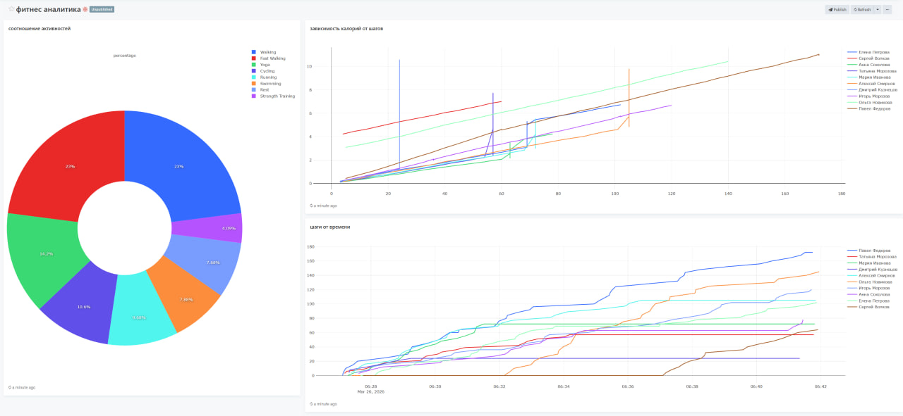
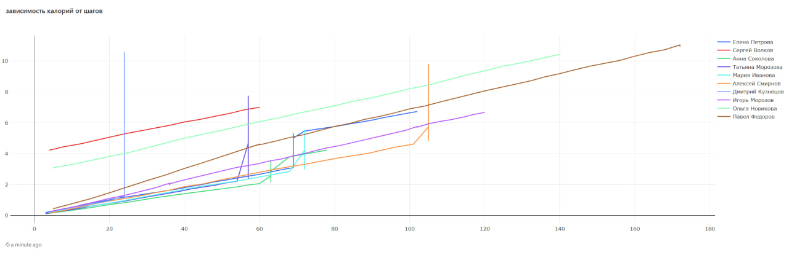
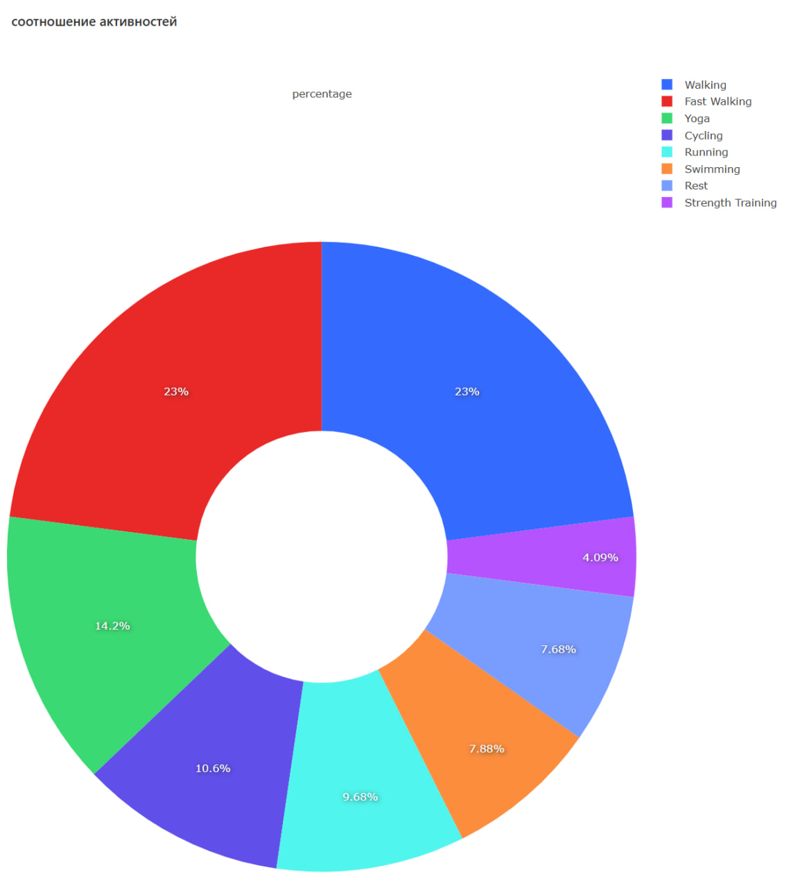
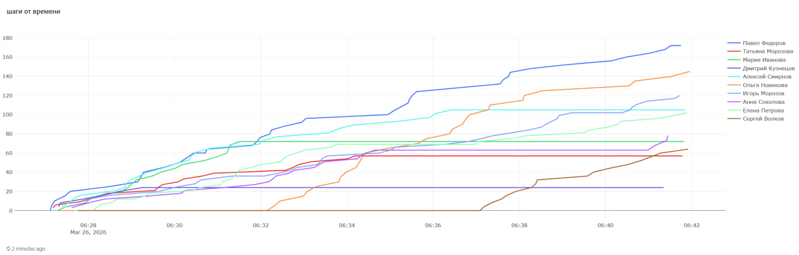

# FEFU_data_analytics_fitness

Assignment for the data analytics course - Fitness Tracker Analytics

## Project Overview

This project simulates a fitness tracker system:
- User accounts and profiles with personalized characteristics
- Real-time fitness data generation (steps, heart rate, calories)
- Multiple activity types (Walking, Running, Cycling, Swimming, Yoga, Strength Training)
- Context-aware activity patterns based on time of day and day of week
- Historical data generation for trend analysis
- Redash dashboard for data visualization and analytics

## Dashboard Example

**Chart1:** 

**Chart2:**

**Chart3:**
